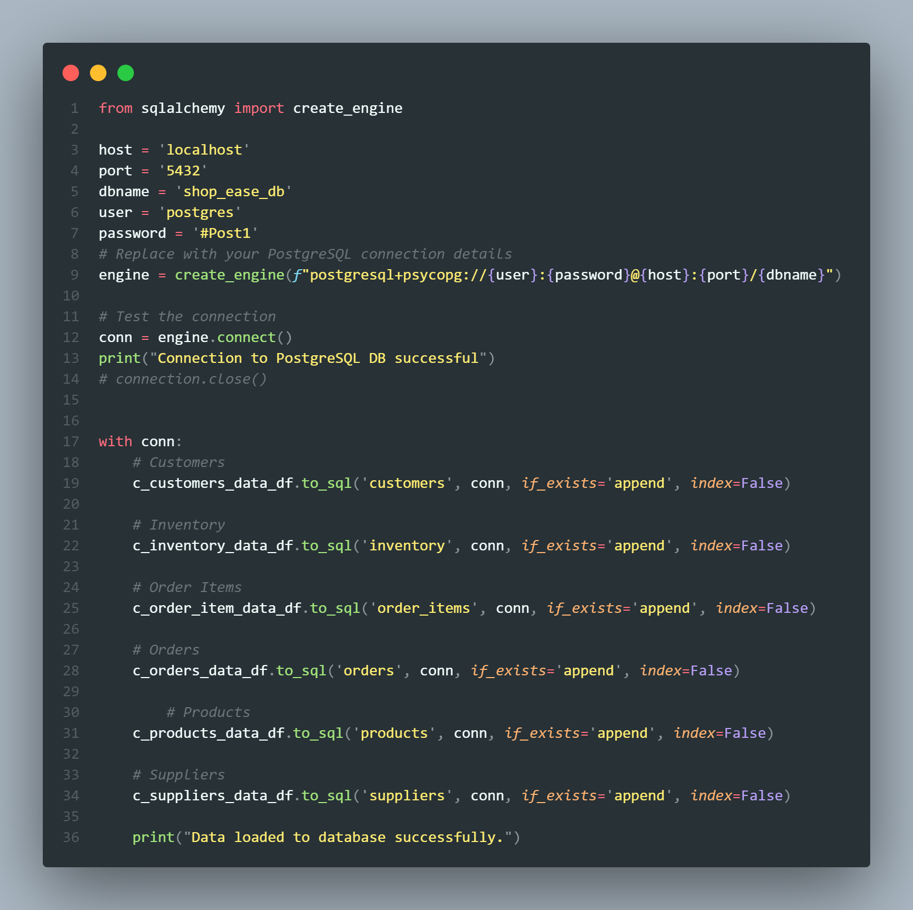

# LAB FOR WEEK TWO

## ShopEase E-Commerce Data Analysis - Partially Completed Task

### Introduction

In this project, I helped **ShopEase**, an e-commerce company, analyze their sales data to support business decisions. The company had collected some data, but they were unsure how to leverage it effectively. As a **data engineer**, my goal was to organize, manipulate, and analyze the provided data to provide valuable insights that would help improve their operations.

### Approach

To address the challenges, I followed the steps outlined below:

#### 1. **Data Collection and Setup**
   - I received CSV files containing the relevant data for the database tables needed to perform the analysis.
   - I created the necessary tables in a database (e.g., MongoDB or MySQL, depending on the setup) and populated them with the provided data.

#### 2. **Data Analysis**
   - I wrote **advanced Python scripts** to interact with the database. These scripts allowed me to clean, manipulate, and analyze the data.
   - Key analyses included identifying trends in sales, customer behavior, and product performance.
   - I used **Pandas** for data manipulation and **Matplotlib/Seaborn** for data visualization to draw actionable insights.

#### 3. **SQL Queries**
   - I wrote and executed **advanced SQL queries** to:
     - Create and modify tables
     - Perform data aggregations (e.g., sales per product, customer purchase patterns)
     - Filter and join tables to extract meaningful insights.
   - I also optimized queries to improve performance, especially for large datasets, by adding appropriate **indexes** and modifying query structures.

#### 4. **Database Optimization**
   - I optimized the database by indexing frequently queried columns and restructuring queries to reduce execution time.
   - By analyzing query performance, I made adjustments that helped improve the efficiency of data retrieval, especially for large and complex queries.

### Tools Used

- **Python**: For scripting, data manipulation (using Pandas and Numpy), and data visualization (using Matplotlib).
- **SQL**: To interact with the database, create tables, and run advanced queries.
- **Database**: PostgreSQL to store, retrieve, and manipulate the data.

### Learning Outcomes

Through this project, I was able to:
- Master advanced Python techniques for data analysis and database interaction.
- Write efficient SQL queries to manipulate and analyze large datasets.
- Understand and implement database optimization strategies to improve query performance.

### Conclusion
Although the project is still in progress, significant groundwork has been laid for the analysis. The foundational steps, such as loading the data, initial analysis, and basic SQL queries, have been completed. The next steps will focus on advanced analysis, optimizing database performance, and finalizing the insights for **ShopEase** to improve their business decisions.

---

### Sample UI

<!-- Add images from UI folder -->

#### Before optimization

#### After optimization

